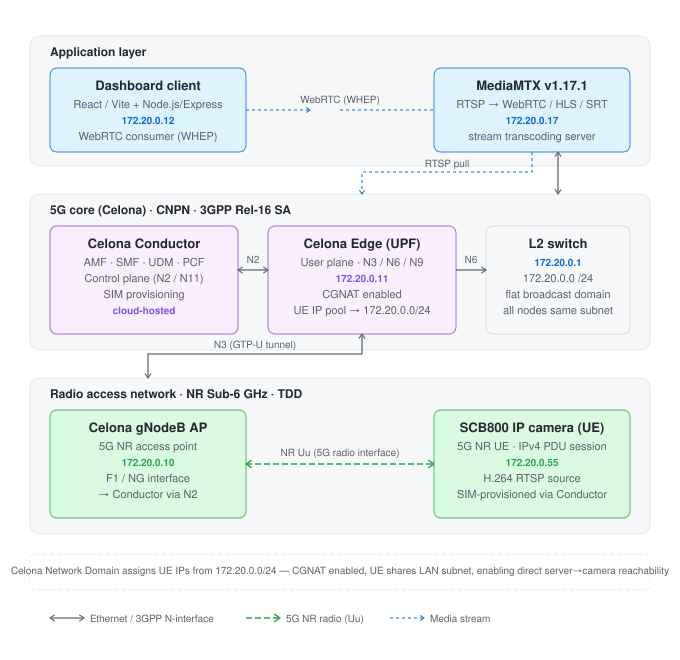
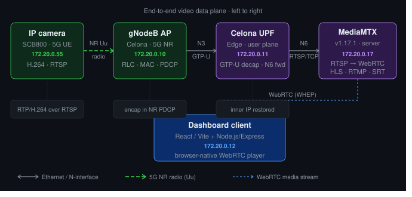
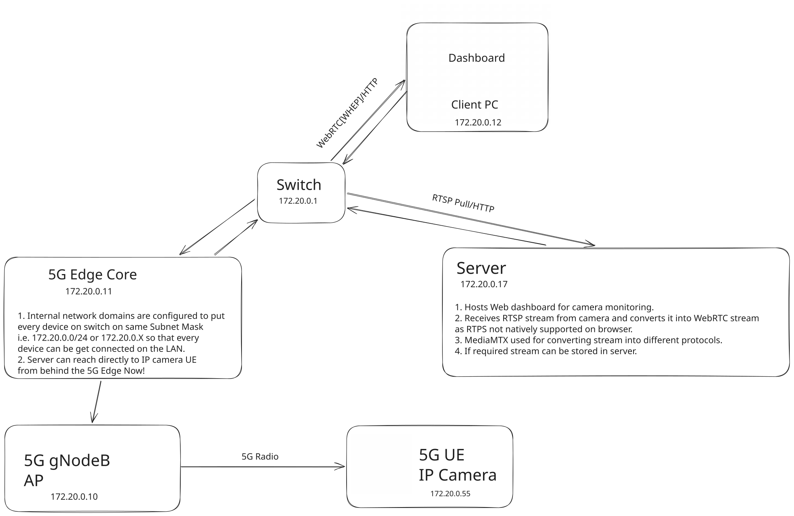
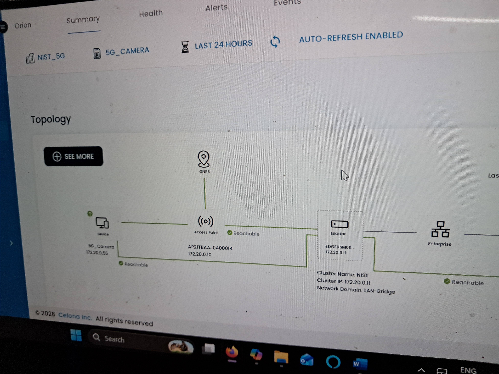

# 📡 Private 5G Live Camera Streaming

**Real-time IP camera surveillance over a private 5G network**
RTSP → MediaMTX → WebRTC → Browser. No public internet. No SIM card plans. No compromises.


*Built at the Private 5G Research Lab · NIST University, Berhampur*

---

## What this project is

A working implementation of live video streaming from a **5G IP camera** to a **browser dashboard** — entirely over a private 5G network with no dependency on the public internet.

The camera connects to the 5G core as a **UE (User Equipment)** with a provisioned SIM. It streams H.264 video over RTSP. A server on the same LAN runs **MediaMTX**, which pulls the RTSP feed and re-publishes it as **WebRTC** via a WHEP endpoint. Any browser on the LAN opens the dashboard and gets a sub-500ms live feed.

The core problem this project solves — and the thing that makes it non-trivial — is **bidirectional reachability between the LAN server and the 5G UE**. By default, 5G cores assign UE IPs from a separate pool and NAT everything outbound. The server can't reach the camera. This project documents exactly how to fix that.

> **The dashboard code in this repo is a reference implementation only.**
> The real value is the **network setup, MediaMTX configuration, and integration pattern**.
> Embed the WebRTC stream into your own dashboard using the iframe or WHEP approach described below.

---

## Screenshots

<p align="center">
  
</p>

---

## System architecture

### Layered view

<p align="center">
  
</p>

### End-to-end data plane

<p align="center">
  
</p>

### Hand-drawn topology (quick reference)

<p align="center">
  
</p>

### Celona dashboard — live network topology

<p align="center">
  
</p>

---

## Component reference

| Component | Role | IP |
|---|---|---|
| Celona Conductor | AMF · SMF · UDM · PCF · SIM provisioning (cloud-hosted) | — |
| Celona Edge (UPF) | User plane · GTP-U decap · N6 forwarding | 172.20.0.11 |
| Celona gNodeB AP | 5G NR radio access point | 172.20.0.10 |
| SCB800 IP Camera | 5G NR UE · H.264 RTSP source | 172.20.0.55 |
| Ubuntu Server 24.04 | MediaMTX + Node.js backend + Nginx | 172.20.0.17 |
| Client PC | React/Vite dashboard | 172.20.0.12 |
| L2 Switch | Flat broadcast domain | 172.20.0.1 |

All devices share `172.20.0.0/24` — this is the key configuration that makes everything work.

---

## Tech stack

| Layer | Technology |
|---|---|
| 5G Core | Celona (Conductor + Edge UPF) · CNPN · 3GPP Rel-16 SA |
| RAN | Celona gNodeB (NR Sub-6 GHz · TDD) |
| Camera / UE | SCB800 5G IP Camera |
| Stream server | MediaMTX v1.17.1 |
| Backend | Node.js + Express |
| Frontend | React + Vite |
| Web server | Nginx (reverse proxy) |
| OS | Ubuntu Server 24.04 LTS |
| Database | PostgreSQL |

---

## How the stream gets from camera to browser

```
SCB800 Camera (UE)
  │  H.264 video · RTSP/TCP
  │  [5G NR Uu radio interface]
  ▼
Celona gNodeB AP
  │  [N3 · GTP-U tunnel]
  ▼
Celona UPF (Edge)
  │  GTP-U decapsulation · N6 forwarding
  │  UE IP on LAN subnet → no CGNAT barrier
  ▼
MediaMTX on Server (172.20.0.17)
  │  Pulls RTSP · republishes as WebRTC (WHEP) + HLS + SRT
  ▼
Browser Dashboard (172.20.0.12)
     WebRTC via WHEP endpoint · <500ms latency
```

---

## Setup guide

### Prerequisites

- A running private 5G core with UPF, AMF, SMF (Celona, Open5GS, free5GC, or OAI)
- A 5G gNodeB (physical or SDR-based)
- A 5G UE — IP camera, smartphone, or simulated UE (UERANSIM)
- Ubuntu Server 22.04 or 24.04 on the LAN
- Node.js v18+

---

### Step 1 — Solve the routing problem

> **This is the most important step. Nothing works until this is right.**

When a UE connects to the 5G core, the UPF assigns it an IP from a **UE IP pool**. By default this pool is a separate subnet from your LAN. The result:

- ✅ Camera → Server: works (UPF NATs outbound)
- ❌ Server → Camera: **broken** (no return route — MediaMTX cannot pull RTSP)

The fix is to make the UE IP pool part of your LAN subnet so all devices share the same broadcast domain and can reach each other directly.

---

#### On Celona — Network Domain configuration

> **Recommendation: use External Network Domain.**
> Internal Network Domain places UE devices directly on the corporate LAN, which is not standard practice for production deployments and can expose UE devices in unintended ways. External Network Domain gives you cleaner separation while still achieving reachability when configured correctly.
>
> Reference: [Celona Intelligent 5G LAN Routing Architecture](https://docs.celona.io/en/articles/7159655-intelligent-5g-lan-routing-architecture)

In **Celona Conductor**:

1. Go to **Network → Network Domains**
2. Select your Network Domain (or create one)
3. Set the **UE IP Address Pool** to a range within your LAN subnet — e.g. `172.20.0.50 – 172.20.0.100`, subnet mask `255.255.255.0`
4. This puts UE IPs on the same `/24` as your server and switch
5. Save → re-register your UE

The camera should now get an IP like `172.20.0.55`. Verify:

```bash
ping 172.20.0.55   # from your server — must succeed before proceeding
```

---

#### On Open5GS

Edit `/etc/open5gs/smf.yaml`:

```yaml
smf:
  subnet:
    - addr: 172.20.0.0/24
      dnn: internet
```

Add a static route on your server so return traffic reaches the UE through the UPF's N6 interface:

```bash
sudo ip route add 172.20.0.0/24 via <UPF_N6_IP>
```

Restart: `sudo systemctl restart open5gs-smfd`

---

#### On free5GC

Edit `config/smfcfg.yaml`:

```yaml
userplaneInformation:
  upNodes:
    UPF:
      sNssaiUpfInfos:
        - dnnUpfInfoList:
            - dnn: internet
              pools:
                - cidr: 172.20.0.0/24
```

Restart: `./run.sh`

---

#### On OAI CN5G

In `docker-compose.yml`, under the `oai-spgwu` service:

```yaml
environment:
  - UE_IP_ADDRESS_POOL=172.20.0.0/24
  - UE_IP_ADDRESS_RANGE=172.20.0.50-172.20.0.200
```

> **Note:** The above Open5GS / free5GC / OAI steps give the right direction but have not been tested on this exact lab setup. Treat them as a starting point — refer to each project's official docs for your specific version. The concept is identical across all cores: match the UE IP pool to your LAN subnet.

---

### Step 2 — Find your camera's RTSP URL

Before configuring MediaMTX, confirm the camera is streaming and what its RTSP path is. This varies by camera manufacturer.

```bash
# Install ffmpeg tools
sudo apt install ffmpeg -y

# Probe the camera — try common paths
ffprobe -v quiet -print_format json -show_streams rtsp://172.20.0.55:554/ch01/0
ffprobe -v quiet -print_format json -show_streams rtsp://172.20.0.55:554/stream
ffprobe -v quiet -print_format json -show_streams rtsp://172.20.0.55:554/live
```

Common RTSP path patterns by manufacturer:

| Manufacturer | Typical RTSP path |
|---|---|
| Hikvision | `/Streaming/Channels/101` |
| Dahua | `/cam/realmonitor?channel=1&subtype=0` |
| Reolink | `/h264Preview_01_main` |
| Axis | `/axis-media/media.amp` |
| Generic / SCB800 | `/ch01/0` |

If `ffprobe` hangs or returns `Connection refused`, the routing from Step 1 is not complete. Do not proceed.

---

### Step 3 — Install MediaMTX

```bash
cd ~
wget https://github.com/bluenviron/mediamtx/releases/download/v1.17.1/mediamtx_v1.17.1_linux_amd64.tar.gz
tar -xzf mediamtx_v1.17.1_linux_amd64.tar.gz
sudo mv mediamtx /usr/local/bin/mediamtx
```

---

### Step 4 — Configure MediaMTX

Copy the `mediamtx.yml` from this repo — it includes tested tweaks for private 5G environments, particularly the ICE host configuration required for WebRTC to work when the server has no public IP.

```bash
sudo cp mediamtx.yml /etc/mediamtx.yml
```

The key sections from the config:

```yaml
# Replace with your camera's actual RTSP URL (found in Step 2)
paths:
  ipCam1:
    source: rtsp://172.20.0.55:554/ch01/0
  # Add more cameras:
  # camera2:
  #   source: rtsp://172.20.0.XX:554/ch01/0

# Critical for WebRTC to work on a private LAN with no public IP.
# Without these, ICE candidate negotiation fails and the browser
# gets no video even though MediaMTX is running fine.
webrtcAdditionalHosts:
  - 172.20.0.17

webrtcICEHostNAT1To1IPs:
  - 172.20.0.17
```

> `webrtcICEHostNAT1To1IPs` is not in the default MediaMTX config. It was added manually after debugging WebRTC ICE failures on the private network. If your browser connects but shows a black frame or spinner, this is likely the missing piece.

Test MediaMTX manually:

```bash
mediamtx /etc/mediamtx.yml
```

Expected output:

```
INF MediaMTX v1.17.1
INF [RTSP] listener opened on :8554
INF [WebRTC] listener opened on :8889
INF [path ipCam1] source RTSP opened
```

Verify WHEP endpoint:

```bash
curl -I http://172.20.0.17:8889/ipCam1/whep
# HTTP 200 = working
```

---

### Step 5 — Run MediaMTX as a system service

```bash
sudo tee /etc/systemd/system/mediamtx.service > /dev/null << 'EOF'
[Unit]
Description=MediaMTX — RTSP/WebRTC streaming server
After=network-online.target
Wants=network-online.target

[Service]
ExecStart=/usr/local/bin/mediamtx /etc/mediamtx.yml
Restart=on-failure
RestartSec=5s
User=www-data

[Install]
WantedBy=multi-user.target
EOF

sudo systemctl daemon-reload
sudo systemctl enable mediamtx
sudo systemctl start mediamtx
sudo systemctl status mediamtx
```

---

### Step 6 — Clone and configure the backend

```bash
git clone https://github.com/grahulreddyofficial/private-5g-streaming.git
cd private-5g-streaming/backend
npm install
```

Create a `.env` file:

```env
PORT=3000
MEDIAMTX_HOST=172.20.0.17
MEDIAMTX_WEBRTC_PORT=8889
MEDIAMTX_HLS_PORT=8888
DB_HOST=localhost
DB_PORT=5432
DB_NAME=5glab
DB_USER=your_db_user
DB_PASSWORD=your_db_password
```

Run the backend as a system service:

```bash
sudo tee /etc/systemd/system/5g-backend.service > /dev/null << EOF
[Unit]
Description=Private 5G Streaming — Node.js backend
After=network-online.target postgresql.service
Wants=network-online.target

[Service]
WorkingDirectory=$(pwd)
ExecStart=/usr/bin/node server.js
Restart=on-failure
RestartSec=5s
EnvironmentFile=$(pwd)/.env
User=$USER

[Install]
WantedBy=multi-user.target
EOF

sudo systemctl daemon-reload
sudo systemctl enable 5g-backend
sudo systemctl start 5g-backend
```

---

### Step 7 — Build and serve the frontend

```bash
cd ../frontend
npm install
npm run build
sudo cp -r dist /var/www/5g-streaming
```

Run the frontend dev server as a service (or skip and serve via Nginx in production):

```bash
# For development — run as a service
sudo tee /etc/systemd/system/5g-frontend.service > /dev/null << EOF
[Unit]
Description=Private 5G Streaming — React frontend (dev)
After=network-online.target

[Service]
WorkingDirectory=$(pwd)
ExecStart=/usr/bin/npm run dev -- --host 0.0.0.0
Restart=on-failure
RestartSec=5s
User=$USER

[Install]
WantedBy=multi-user.target
EOF

sudo systemctl daemon-reload
sudo systemctl enable 5g-frontend
sudo systemctl start 5g-frontend
```

---

### Step 8 — Enable PostgreSQL on boot

```bash
sudo systemctl enable postgresql
sudo systemctl start postgresql
```

---

### Step 9 — Configure Nginx

```bash
sudo tee /etc/nginx/sites-available/5g-streaming > /dev/null << 'EOF'
server {
    listen 80;
    server_name 172.20.0.17;

    # Serve built React frontend
    root /var/www/5g-streaming;
    index index.html;
    location / {
        try_files $uri $uri/ /index.html;
    }

    # Proxy backend API
    location /api/ {
        proxy_pass http://127.0.0.1:3000;
        proxy_set_header Host $host;
        proxy_set_header X-Real-IP $remote_addr;
    }

    # Proxy MediaMTX WebRTC (WHEP)
    location /whep/ {
        proxy_pass http://127.0.0.1:8889/;
        proxy_http_version 1.1;
        proxy_set_header Upgrade $http_upgrade;
        proxy_set_header Connection "upgrade";
    }

    # Proxy MediaMTX HLS fallback
    location /hls/ {
        proxy_pass http://127.0.0.1:8888/;
    }
}
EOF

sudo ln -s /etc/nginx/sites-available/5g-streaming /etc/nginx/sites-enabled/
sudo nginx -t && sudo systemctl reload nginx
sudo systemctl enable nginx
```

---

## Integrating the stream into your own dashboard

> The reference dashboard in this repo uses a simple iframe pointing at MediaMTX's built-in WebRTC player. You do not need to copy the dashboard code. Here is how to embed the stream in any web project.

### Option 1 — iframe embed (simplest)

MediaMTX ships a built-in WebRTC player page. Just embed it:

```html
<iframe
  src="http://172.20.0.17:8889/ipCam1"
  width="1280"
  height="720"
  frameborder="0"
  allowfullscreen
  allow="autoplay; camera"
></iframe>
```

No signalling code. No WebRTC boilerplate. MediaMTX handles everything — ICE negotiation, WHEP exchange, codec handling. The iframe renders a live H.264 stream in the browser.

Replace `ipCam1` with whatever path name you gave your camera in `mediamtx.yml`.

### Option 2 — WHEP endpoint (native WebRTC, no iframe)

If you want to render the video in your own `<video>` element without an iframe:

```html
<video id="stream" autoplay muted playsinline></video>
```

```javascript
// Minimal WHEP client — no library needed
async function startStream(whepUrl, videoElement) {
  const pc = new RTCPeerConnection({
    iceServers: [{ urls: 'stun:stun.l.google.com:19302' }]
  });

  pc.addTransceiver('video', { direction: 'recvonly' });
  pc.addTransceiver('audio', { direction: 'recvonly' });

  pc.ontrack = (event) => {
    videoElement.srcObject = event.streams[0];
  };

  const offer = await pc.createOffer();
  await pc.setLocalDescription(offer);

  const response = await fetch(whepUrl, {
    method: 'POST',
    headers: { 'Content-Type': 'application/sdp' },
    body: offer.sdp,
  });

  const answer = await response.text();
  await pc.setRemoteDescription({ type: 'answer', sdp: answer });
}

startStream(
  'http://172.20.0.17:8889/ipCam1/whep',
  document.getElementById('stream')
);
```

This is the raw WHEP exchange — an SDP offer POST, an SDP answer back, no signalling server, no socket connections. If you want a production-grade client, use [`@eyevinn/whep-web-client`](https://www.npmjs.com/package/@eyevinn/whep-web-client).

### Option 3 — HLS fallback (maximum compatibility)

For environments where WebRTC is blocked or unreliable, MediaMTX also publishes an HLS feed:

```
http://172.20.0.17:8888/ipCam1/index.m3u8
```

Use with `hls.js` for browsers that don't support HLS natively:

```bash
npm install hls.js
```

```javascript
import Hls from 'hls.js';

const video = document.getElementById('stream');
const src = 'http://172.20.0.17:8888/ipCam1/index.m3u8';

if (Hls.isSupported()) {
  const hls = new Hls({ lowLatencyMode: true });
  hls.loadSource(src);
  hls.attachMedia(video);
} else if (video.canPlayType('application/vnd.apple.mpegurl')) {
  video.src = src; // Safari native HLS
}
```

HLS latency is typically 3–8 seconds. Use WebRTC (WHEP) for real-time monitoring.

---

## Service management quick reference

```bash
# Check all services
sudo systemctl status mediamtx 5g-backend 5g-frontend nginx postgresql

# Restart after config changes
sudo systemctl restart mediamtx
sudo systemctl restart 5g-backend

# View logs
sudo journalctl -u mediamtx -f
sudo journalctl -u 5g-backend -f
```

---

## Troubleshooting

**`ping 172.20.0.55` from server fails**
The UE IP pool is not on the LAN subnet. Revisit the Network Domain configuration in Step 1. Also check that the camera is registered on the 5G core by checking AMF/UE registration logs in Celona Conductor.

**MediaMTX shows `connection refused` for RTSP source**
Wrong RTSP path or port. Run `ffprobe rtsp://172.20.0.55:554/` and try the paths listed in Step 2. Also confirm the camera's RTSP server is enabled in its settings menu.

**Browser connects to WHEP but shows black frame or spinner**
Missing ICE host config. Confirm `webrtcICEHostNAT1To1IPs` is set to your server's LAN IP in `mediamtx.yml`. This is the most common WebRTC failure on private networks without a STUN/TURN server.

**Stream works in VLC but not in browser**
Check for H.265/HEVC — browsers do not support it natively in WebRTC. Set the camera to H.264 in its video encoding settings.

**High latency (> 3 seconds)**
You are likely hitting the HLS endpoint. Confirm the dashboard or your integration is using the WHEP URL (port 8889), not the HLS URL (port 8888).

**Backend service fails to start**
Check `.env` is present and PostgreSQL is running: `sudo systemctl status postgresql`. Check logs: `sudo journalctl -u 5g-backend -n 50`.

---

## Repository structure

```
private-5g-streaming/
├── backend/                  # Node.js + Express API
│   ├── routes/
│   └── package.json
├── frontend/                 # React + Vite dashboard
│   └── src/
│       ├── components/
│       └── hooks/            # useWhepStream (WebRTC)
├── docs/
│   ├── architecture.svg      # Layered system architecture
│   ├── dataplane.svg         # End-to-end data plane flow
│   ├── dashboard.png         # Dashboard screenshot
│   └── celona-topology.png   # Live topology from Celona UI
├── mediamtx.yml              # Tuned MediaMTX config (use this one)
├── LICENSE
└── README.md
```

---

## References

- [Celona Intelligent 5G LAN Routing Architecture](https://docs.celona.io/en/articles/7159655-intelligent-5g-lan-routing-architecture)
- [MediaMTX documentation](https://github.com/bluenviron/mediamtx)
- [WHEP — WebRTC-HTTP Egress Protocol (RFC draft)](https://www.ietf.org/archive/id/draft-murillo-whep-03.txt)
- [3GPP TS 23.501 — 5G System Architecture](https://www.3gpp.org/ftp/Specs/archive/23_series/23.501/)
- [Open5GS documentation](https://open5gs.org/open5gs/docs/)
- [free5GC documentation](https://free5gc.org/guide/)

---

## About

This project was built as part of hands-on 5G research at **NIST University's Private 5G Research Lab**, Berhampur, Odisha, India — running on Celona-based CNPN infrastructure compliant with 3GPP Release 16 Standalone architecture.

The goal was to explore practical private 5G use cases beyond connectivity benchmarks — specifically, replacing traditional wired or Wi-Fi surveillance infrastructure with a managed 5G UE pipeline.

---

## License

MIT — see [LICENSE](LICENSE) for details.
